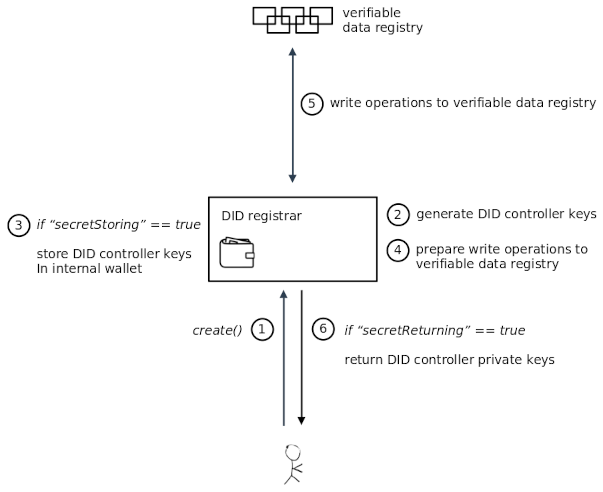
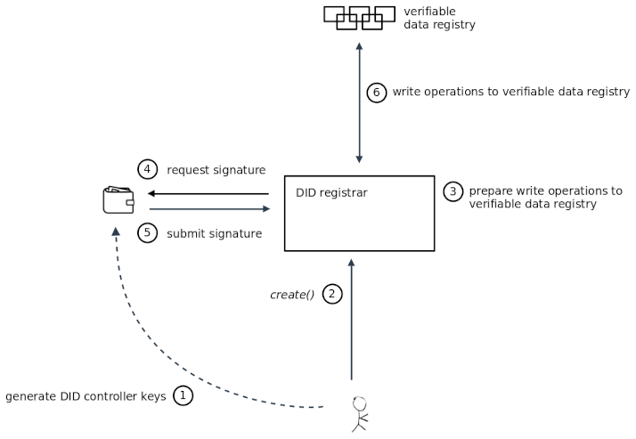
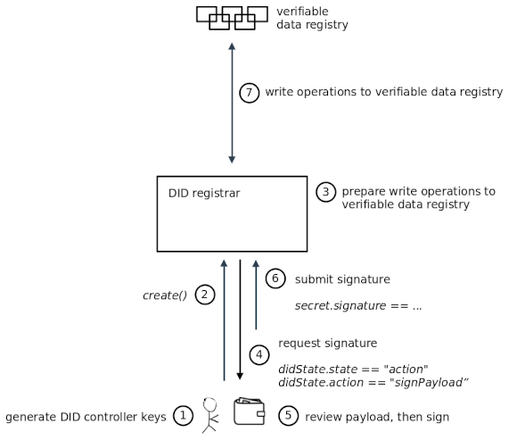

# Peopledata DID Registration

## 1. Abstract

Each DID method specifies how to create/resolve/update/deactivate DIDs within a given verifiable data registry. How exactly this works can be very different depending on the DID method and may involve various steps, architectural components, and network communication. 

The process of resolving a DID to a DID document by executing the read() operation is well-understood and specified in the DID Resolution specification. This document complements the concept of a “DID Resolver” by also defining a “DID Registrar” component that can execute the three remaining create/update/deactivate operations via a common interface.

This specification does NOT specify a DID method. It does NOT specify how to build a verifiable data registry, only a “DID Registrar” component that can interact with a verifiable data registry. This specification also does NOT suggest that private keys should be controlled by any other entity than the DID controller.

`Peopledata-did-registrar` is developemnt under [DIF's did-registration specification](https://identity.foundation/did-registration/).

## 2. Status of the DIF DID Registration

DID Registration is a draft specification under development within the [Decentralized Identity Foundation:DIF](https://identity.foundation/), and designed to incorporate the requirements and learnings from related work of the most active industry players into a shared specification that meets the collective needs of the community. This spec is regularly updated to reflect relevant changes, and we encourage active engagement on GitHub (see above) and other mediums (e.g. DIF) where this work is being done.

## 3. Terminology

- **Decentralized Identifier (DID)**	
A globally unique persistent identifier that does not require a centralized registration authority and is often generated and/or registered cryptographically.

- **DID Method**	
A definition of how a specific DID scheme implementeds the precise operations by which DIDs are created, resolved and deactivated and DID documents are written and updated.

- **DID Document**	
A set of data describing the DID subject, service and verification methods, that the DID subject or a DID delegate can use to authenticate itself and prove its association with the DID.

- **DID Registrar**	
A software and/or hardware component that implements the DID create/update/deactivate functions.

- **DID Resolver**	
A software and/or hardware component that implements the DID resolution function.

- **Wallet**	
A software and/or hardware component that can securely store DIDs and associated private keys and other sensitive cryptographic key material. Wallets implement various interfaces for cryptographic key generation, signing, verification, and other operations.

## 4. Architecture Modes

The DID create/update/deactivate functions raise architectural questions around key management, since they typically involve the generation and use of private keys and other secrets.

With regard to key management, a DID Registrar can operate in the following modes:

### 4.1 Internal Secret Mode
In this mode, the DID Registrar is responsible for generating the DID controller keys used by DID operations. This means that the DID Registrar is considered a highly trusted component which should be fully under the control of a DID controller. If it is operated as a remotely hosted service, secure connection protocols such as TLS, DIDComm, etc. MUST be used.

This mode has two options that control how DID controller keys are handled.

#### 4.1.1 storeSecrets Option
If the `storeSecrets` option is set to `true`, then the DID Registrar maintains an internal wallet where DIDs and DID controller keys can be stored. The DID controller keys can then be used in future DID operations. For example, if a `create()` operation is executed, then a subsequent `update()` or `deactivate()` operation will be able to use existing DID controller keys stored in the DID Registrar.

[TODO]: Mention potential import/export of keys, and how this could relate to other specs such as Universal Wallet or WebKMS or the WebCrypto API.

#### 4.1.2 returnSecrets Option

If the `returnSecrets` option is set to `true`, then the DID Registrar will return generated DID controller keys to the client.

#### 4.1.3 Considerations

The `storeSecrets` and `returnSecrets` options can be enabled or disabled independently. A DID Registrar may define default values for these options, and/or it may allow a client to set them via the `options` input field.

Note that if neither option is enabled, then control over a DID may get permanently lost, since the DID Registrar operating in `Internal Secret Mode` will generate DID controller keys internally, but it will neither store them nor return them to a client.

If a DID Registrar is configured with options `storeSecrets=false` and `returnSecrets=true`, then a DID Registrar with option `storeSecrets=true` can be simulated by building a “wrapping DID Registrar” around an “inner DID Registrar”.

Diagram showing Internal Secret Mode

### 4.2 External Secret Mode

In this mode, the DID Registrar does not itself have access to the secrets used by DID operations, but it has a way of accessing an external wallet in order to perform cryptographic operations such as generating signatures.

[TODO]: Mention how this could relate to other specs such as [Universal Wallet] or [WebKMS] or the [WebCrypto API].

Diagram showing External Secret Mode

### 4.3 Client-managed Secret Mode

In this mode, the DID Registrar does not itself have access to the secrets used by DID operations, but it will ask the client to perform cryptographic operations such as generating signatures.

TODO: Discuss how the did:ion use case fits in, where the client supplies the public keys / commitments during the create operation.

Diagram showing Client-Managed Secret Mode

## 5. Operations

### 5.1 `create()`

This function creates a new DID and associated DID document, according to a known DID method, using various options and optionally an initial DID document.

### 5.2 `delete()`

delete an identifier.

### 5.3 `deactive()`

deactive an identifier.

