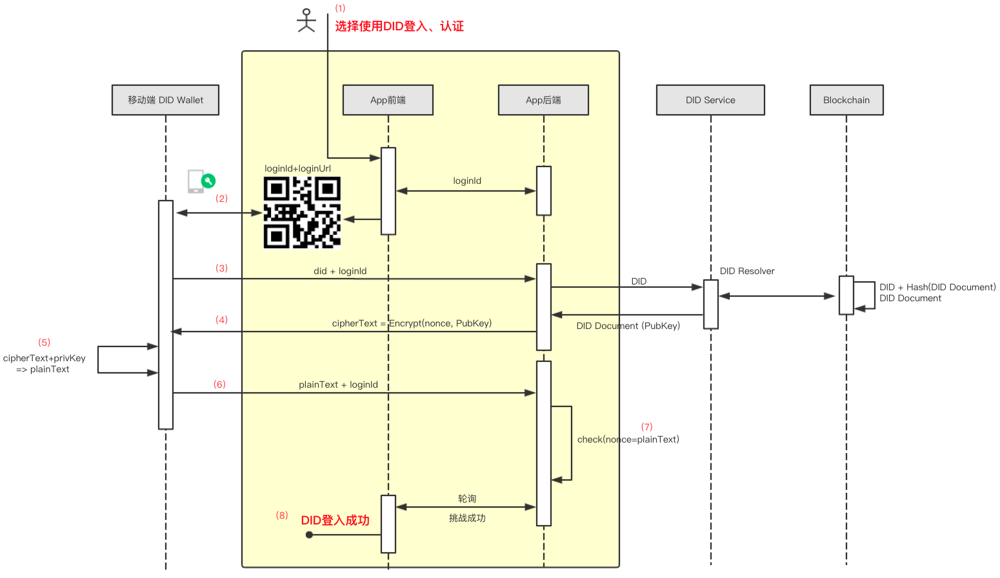

# Peopledata DID Specification(draft version 0.1.0)

## DID Document Definition

Peopledata DID Syntax is:

```json
did:peopledata:<method-specific-id>
```
for example:
```
did:peopledata:f334484858571199b681f6dfdd9ecd2f01df5b38f8379b3aaa89436c61fd1955
```

and, 
`<method-specific-id> = base58(repemd160(sha256(<Base DID Document>)))`

a sample `<DID Document>` as follows:

```json
{
  "@context": "https://w3id.org/did/v1",
  "publicKey": [
    {
      "id": "#keys-1",
      "type": "Secp256k1",
      "publicKeyHex": "02b97c30de767f084ce3080168ee293053ba33b235d7116a3263d29f1450936b71" // keys-1 Hex
    },
    {
      "id": "#keys-2",
      "type": "Secp256k1",
      "publicKeyHex": "4b4042665b3235a12fb49730ff620fef1c96e9efa5c90119abd2e8acfe856053"
    }
  ],
  "verificationMethod":[
    {
        "id": "did:peopledata:<123456789abcdefghi>",
        "type": "EcdsaSecp256k1RecoveryMethod2020",
        "controller": "did:peopledata:<123456789abcdefghi>",
        "blockchaininAccountId": "<blockchain account address>"
    },
    {
        "id": "did:peopledata:<123456789abcdefghi>#keys-1",
        "type": "EcdsaSecp256k1VerificationKey2019",
        "controller":  "did:peopledata:<123456789abcdefghi>",
        "publicKeyHex": "02b97c30de767f084ce3080168ee293053ba33b235d7116a3263d29f1450936b71" // keys-1 hex

    }
  ],
  "authentication": [
    "did:peopledata:<123456789abcdefghi>#keys-1",
    ],
  "recovery": ["did:peopledata:<123456789abcdefghi>#key-2"],
  "service": [
    {
      "id": "did:peopledata:<123456789abcdefghi>",
      "type": "DIDResolver",
      "serviceEndpoint": "https://did.peopledata.org.cn"
    }
  ],
  "proof" : {
    "type": "EcdsaSecp256k1VerificationKey2019",
    "creator": "did:peopledata:<<123456789abcdefghi>",
    "signatureValue": "<JWT>"

  }
}
```

- `publicKey`: a list of public key;
- `authentication`: The Owner of this DID is who hold the privateKey which correspond to the publicKey. use `<did>#keys=<n>` to specify.
- `recovery`: publicKey which could recovery.
- `seervice`: a list of endpoint which could use this DID. e.g. DIDResolver

The algorithm of generate key-pair is Secp256k1. One should add some other algorithm such as RSA.

Each DID Document *MUST* have three basic components [VC Data Model](https://www.w3.org/TR/vc-data-model/):

- Verification Method Type ( 1 or many )
- Key Types (1 or many)
- Proving 
- Encrypting

The enteris in a DID document including: 


## DID Creation

The process create DID is:
- 1. Generate two keypaire, one is master, one is backup;
- 2. generate `<Base DID Document>

a `<Base DID Document>` :
```json
{
  "@context": "https://w3id.org/did/v1",
  "publicKey": [
    {
      "id": "#keys-1",
      "type": "Secp256k1",
      "publicKeyHex": "02b97c30de767f084ce3080168ee293053ba33b235d7116a3263d29f1450936b71"
    },
    {
      "id": "#keys-2",
      "type": "Secp256k1",
      "publicKeyHex": "4b4042665b3235a12fb49730ff620fef1c96e9efa5c90119abd2e8acfe856053"
    }
  ],
  "authentication": ["#key-1"],
  "recovery": ["#key-2"]
}
```
- 3. Hash `<Base DID Document>`
  sha256(`<Base DID Document>`)

- 4. use `ripemd160` to process above results 
- 5. use `base58`  to process above resulits
- 6. add pre-fix `did:peopledata:` on above results

Request a DID Creation as below:
```json
{
    "did": "did:peopledata:<>",
    "document": {
        "@context": "https://w3id.org/did/v1",
        "id": "did:peopledata:<>",
        "version": 1,
        "created": "2020-10-23T09:14:17.961Z",
        "updated": "2020-10-23T09:14:17.961Z",
        "publicKey": [
            {
                "id": "did:peopledata:<>#key-1",
                "type": "Secp256k1",
                "publicKeyHex": "0440b3fa8e848297ff26b04088263101fa87d3541ac48bbc32fe7b77b73246578241236ab6097d4012ac17a514272a54a7b728790e914bbbff431e49d421aa1eef"
            },
            {
                "id": "did:peopledata:<>#key-2",
                "type": "Secp256k1",
                "publicKeyHex": "04df4cf82984c9ecd4cf113e24762fb4404c1653df84ac424e4e2985ba7eb4de9249c2609414a24feea7845649299049b4babd6380ee69ef9e91c843931c877e7f"
            }
        ],
        "authentication": [
            "did:peopledata:<>#key-1"
        ],
        "recovery": [
            "did:peopledata:<>#key-2"
        ],
        "service": [
            {
                "id": "did:peopledata:<>#resolver",
                "type": "DIDResolve",
                "serviceEndpoint": "https://did.peopledata.org.cn"
            }
        ],
        "proof": {
            "type": "Secp256k1",
            "creator": "did:peopledata:<>#key-1",
            "signatureValue": "3045022100ff51c2629c9eb5d75d9786506ad45e82a87bf91b991a4b37f6d81ce70984220302201f4aa4f609a7ff96de190db68a25603fc849f1098d3f506098dc79af826b4a67"
        }
    },
    "operation": "create",
    "timestamp": 253146316
}
```

## DID Resolve

Input a DID to `DID Resolver`, return its coresspond `DID Document`. 

```bahs
$ curl https://did.peopledata.org.cn/1.0/identifiers/did:peopledata:<>

```

The results shoud be:

```json
{
  "code": 0,
  "message": "ok",
  "requestId": "",
  "content": {
    "didDocument": {
      "@context": "https://w3id.org/did/v1",
      "id": "did:peopledata:<>",
      "version": 2,
      "created": "2019-10-21T11:12:13.065Z",
      "updated": "2019-10-21T11:17:49.379Z",
      "publicKey": [
        {
          "id": "did:peopledata:<>#key-1",
          "type": "Secp256k1",
          "publicKeyHex": "046fcbedd1107ca45be3e81fc445e5a366886a89e7087fe3d128e6236302f31594740f250433ebe9f0abcbd04dbf9c5979e270a0772ad1cc502cec2d5de9504c8c"
        },
        {
          "id": "did:peopledata:<>#key-2",
          "type": "Secp256k1",
          "publicKeyHex": "0496712d16b0836684aacd5ab6ba3d489c35efa31f414a1c6a455fc6b37ff28e5fa97ac29c1021b76e5b78e2bbceac1dfc4ec98e6b2b3e65a29f7f1cd4944dfb93"
        }
      ],
      "authentication": ["did:peopledata:<>#key-1"],
      "recovery": ["did:peopledata:<>#key-2"],
      "service": [
        {
          "id": "did:peopledata:<>#resolver",
          "type": "DIDResolve",
          "serviceEndpoint": "https://did.peopledata.org.cn"
        }
      ],
      "proof": {
        "type": "Secp256k1",
        "creator": "did:peopledata:<>#key-1",
        "signatureValue": "30440220211ffc76ae2858d6baa29faa9b576d6b2e048e8f4f7767ee1c2fba7ae6c2a78102205f5b56cd1431830b45109d716631638d961e5b252c2c2354d8bb96782d8a62ef"
      }
    }
  }
}
```

## DID Update

- update pulicKey coresspond to master privateKey 
- update publicKey coresspond to backup priavteKey
- update `<service>`

a sample of update request: ( signature will use recovery key in last version `<DID Document>`)

```json
{
    "did": "did:peopledata:<>",
    "document": {
        "@context": "https://w3id.org/did/v1",
        "id": "did:peopledata:<>",
        "version": 1,
        "created": "2020-10-23T09:14:17.961Z",
        "updated": "2020-10-23T09:14:17.961Z",
        "publicKey": [
            {
                "id": "did:peopledata:<>#key-1",
                "type": "Secp256k1",
                "publicKeyHex": "0440b3fa8e848297ff26b04088263101fa87d3541ac48bbc32fe7b77b73246578241236ab6097d4012ac17a514272a54a7b728790e914bbbff431e49d421aa1eef"
            },
            {
                "id": "did:peopledata:<>#key-2",
                "type": "Secp256k1",
                "publicKeyHex": "04df4cf82984c9ecd4cf113e24762fb4404c1653df84ac424e4e2985ba7eb4de9249c2609414a24feea7845649299049b4babd6380ee69ef9e91c843931c877e7f"
            }
        ],
        "authentication": [
            "did:peopledata:<>#key-1"
        ],
        "recovery": [
            "did:peopledata:<>#key-2"
        ],
        "service": [
            {
                "id": "did:peopledata:<>#resolver",
                "type": "DIDResolve",
                "serviceEndpoint": "https://did.peopledata.org.cn"
            }
        ],
        "proof": {
            "type": "Secp256k1",
            "creator": "did:peopledata:<>#key-1",
            "signatureValue": "3045022100ff51c2629c9eb5d75d9786506ad45e82a87bf91b991a4b37f6d81ce70984220302201f4aa4f609a7ff96de190db68a25603fc849f1098d3f506098dc79af826b4a67"
        }
    },
    "operation": "edit",
    "timestamp": 253146316,
    "signature": "212w6nedqdm2wdp2dpdkasxkapp12kw12w12w"
}
```


## DID Revoke

When one revoke a DID, send a request: (signature will use recovery key in last version `<DID Document>`)

```json
{
    "did": "did:peopledata:<>",
    "operation": "delete",
    "timestamp": 253146316,
    "signature": "212w6nedqdm2wdp2dpdkasxkapp12kw12w12w"
}
```

## DID Authentication Workflow

When users use DID on the App, they have to prove that they are the owner of the DID. The main mechanism used is the `challenge-response mechanism`:
The App first finds the corresponding DID Document from the DID Resolver according to the DID provided by the user, and then the App uses the public key in the DID Document to encrypt a string of nonces randomly generated by itself, and sends it to the user. The user decrypts with his own private key and obtains this String the nonce and send the nonce to the App to complete the challenge.


## DID Login Workflow

**User operation process**:

- 1. Choose to log in/authenticate with DID to display a QR code
- 2. The user scans the QR code with the mobile DID Wallet and confirms the login on the Wallet
Login completed.


**Internal Challenge Response Process**:

- 1. Choose to use DID to log in/authenticate, display a QR code, the key information on the QR code: loginId, loginUrl
- 2. The user scans the QR code with the mobile DID Wallet to get the loginId and loginUrl
- 3. User sends did and loginId to loginUrl
- 4. After the target App backend receives the request, it first goes to the DID Resolver to obtain the Document corresponding to the DID and obtains the public key in the Document; then use the public key to encrypt a randomly generated nonce to obtain the encrypted result ciphertext and return it to DID Wallet
- 5. Mobile DID Wallet decrypts ciphertext with the private key corresponding to did to get plainText
- 6. The mobile DID Wallet sends this plainText and loginId to the target App backend
- 7. The target App backend verifies the challenge response result, that is, plainText=nonce
The target App front-end polls and learns that the challenge is successful, that is, the login is successful



## Signature

Use ECDSA signature standards.

## Privacy Considerations

The information related to user privacy is not on the chain, but on the side of the issuer (authoritative organization), the statement issued by the issuer is used to prove the user's privacy attributes, so as to better protect the user's privacy from being leaked.
The private key that can prove the attribution of DID only exists on the user's device and will not be known to any third party.
DID Document uses signature technology to prevent malicious tampering.

## Security considerations

Identity recovery: After the private key of the authority is lost, the master private key can be reset through the recovery private key, but in this case, the claim signed out before will be invalid.
The bottom layer supports the use of alliances based on `Quorum blockchain` transformation, with better node access and privacy transaction capabilities.


